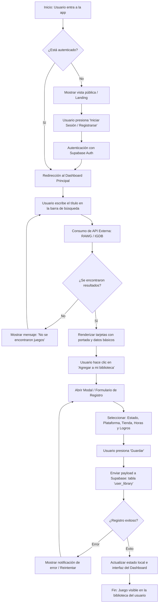
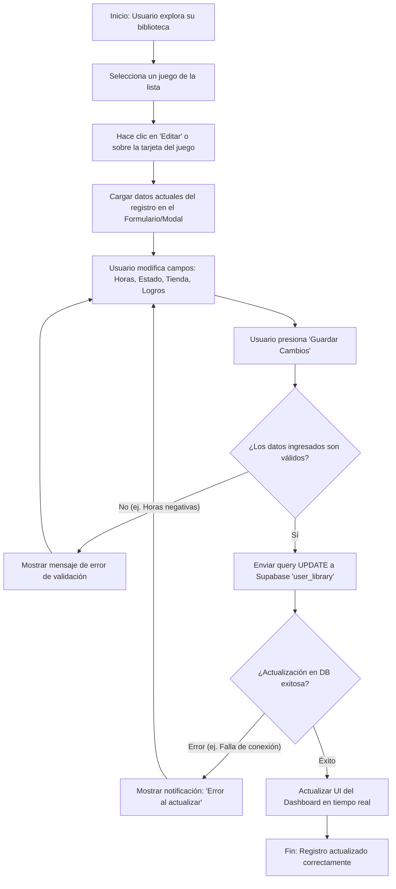

# Biblioteca de juegos y manejo de datos

## 1. Descripción del Proyecto
Aplicación web full-stack para la gestión de biblioteca personal de videojuegos, seguimiento de progreso, horas jugadas, logros y estadísticas visuales. Diseñada para soporte multiusuario.

---

## 2. Stack Tecnológico
- **Frontend:** Astro (SSR), Tailwind CSS, JavaScript / TypeScript.
- **Backend & DB:** Supabase (Autenticación + PostgreSQL).
- **API Externa:** RAWG API (o IGDB) para catálogo de datos e imágenes.

---

## 3. Requisitos del Sistema

### 3.1. Requisitos Funcionales (RF)
- **RF-01 Autenticación:** El sistema debe permitir registro e inicio de sesión de usuarios (Supabase Auth).
- **RF-02 Buscador de Juegos:** El usuario puede buscar títulos consumiendo la API externa.
- **RF-03 Gestión de Biblioteca (CRUD):**
  - Agregar juegos a la biblioteca personal asignando: Estado, Plataforma (Dispositivo), Tienda (Distribuidor), Horas jugadas y Logros completados.
  - Editar datos de seguimiento: *Estado (Jugando, Completado, En Pausa, Abandonado, Pendiente)*, *Plataforma*, *Horas jugadas*, *Logros completados*.
  - Eliminar juegos de la biblioteca.
- **RF-04 Visualización de Portadas:** Mostrar tarjetas visuales con la imagen de portada y progreso de cada título.
- **RF-05 Seguridad de Datos:** Cada usuario solo puede ver y editar su propia biblioteca.

### 3.2. Requisitos No Funcionales (RNF)
- **RNF-01 Rendimiento:** Carga optimizada de imágenes y páginas con Server-Side Rendering (SSR).
- **RNF-02 Seguridad:** Políticas de seguridad a nivel de fila (RLS) aplicadas en la base de datos PostgreSQL.
- **RNF-03 Diseño Responsivo:** Interfaz adaptada a pantallas móviles y de escritorio.

---

## 4. Estructura de Datos (Borrador inicial)

### Tabla: `user_library`
| Campo | Tipo | Descripción |
| :--- | :--- | :--- |
| `id` | UUID / Primary Key | Identificador único del registro |
| `user_id` | UUID / Foreign Key | ID del usuario propietario (vía Supabase Auth) |
| `rawg_id` | Integer / String | ID del juego en la API externa |
| `title` | String | Nombre del videojuego |
| `cover_url` | String | Enlace a la imagen de portada |
| `platform` | String | Dispositivo/Consola (ej. PC, PS5, Switch, Android, iOS) |
| `store` | String | Tienda/Distribuidor (ej. Steam, Epic Games, GOG, PS Store, Play Store) |
| `status` | Enum / String | `playing`, `completed`, `on_hold`, `dropped`, `backlog` |
| `hours_played` | Numeric / Float | Horas de juego invertidas |
| `achievements_progress` | Integer | Porcentaje o cantidad de logros completados |
| `created_at` | Timestamp | Fecha de adición a la biblioteca |

---

## 🔄 5. Diagramas de Flujo (Lógica del Sistema)

### 5.1. Flujo: Búsqueda y Adición de un Juego a la Biblioteca



### 5.2. Flujo: Edición y Actualización de Registro en la Biblioteca



---

## 📁 6. Arquitectura del Proyecto y Estructura de Carpetas

```text
game-tracker/
├── public/                     # Archivos estáticos (favicon, iconos, imágenes locales)
├── src/
│   ├── components/            # Componentes de UI reutilizables
│   │   ├── common/            # Botones, Modales, Navbars, Footers
│   │   ├── dashboard/         # Tarjetas de juegos, Filtros, Métricas/Stats
│   │   └── search/            # Barra de búsqueda, Resultados de la API
│   ├── layouts/               # Plantillas base (Layout.astro, AuthLayout.astro)
│   ├── lib/                   # Configuraciones y clientes de servicios externos
│   │   ├── supabase.js        # Cliente de Supabase (Auth + DB)
│   │   └── rawg.js            # Funciones para consumir la API de RAWG/IGDB
│   ├── pages/                 # Rutas de la aplicación (SSR)
│   │   ├── api/               # Endpoints/API Routes (si se requieren)
│   │   ├── index.astro        # Landing page / Portada pública
│   │   ├── login.astro        # Vista de Inicio de Sesión / Registro
│   │   └── dashboard.astro    # Vista principal de la biblioteca del usuario
│   ├── styles/                # Estilos globales y configuración de Tailwind CSS
│   └── types/                 # Definiciones de TypeScript e interfaces (juegos, usuario)
├── .env.example               # Plantilla para variables de entorno (API keys, Supabase URL)
├── .gitignore                 # Archivos omitidos para Git (node_modules, .env)
├── DOCUMENTACION.md           # Especificaciones del proyecto e ingeniería
├── README.md                  # Documentación principal del repositorio
├── astro.config.mjs           # Configuración de Astro (modo SSR + Tailwind)
└── package.json               # Dependencias del proyecto
```